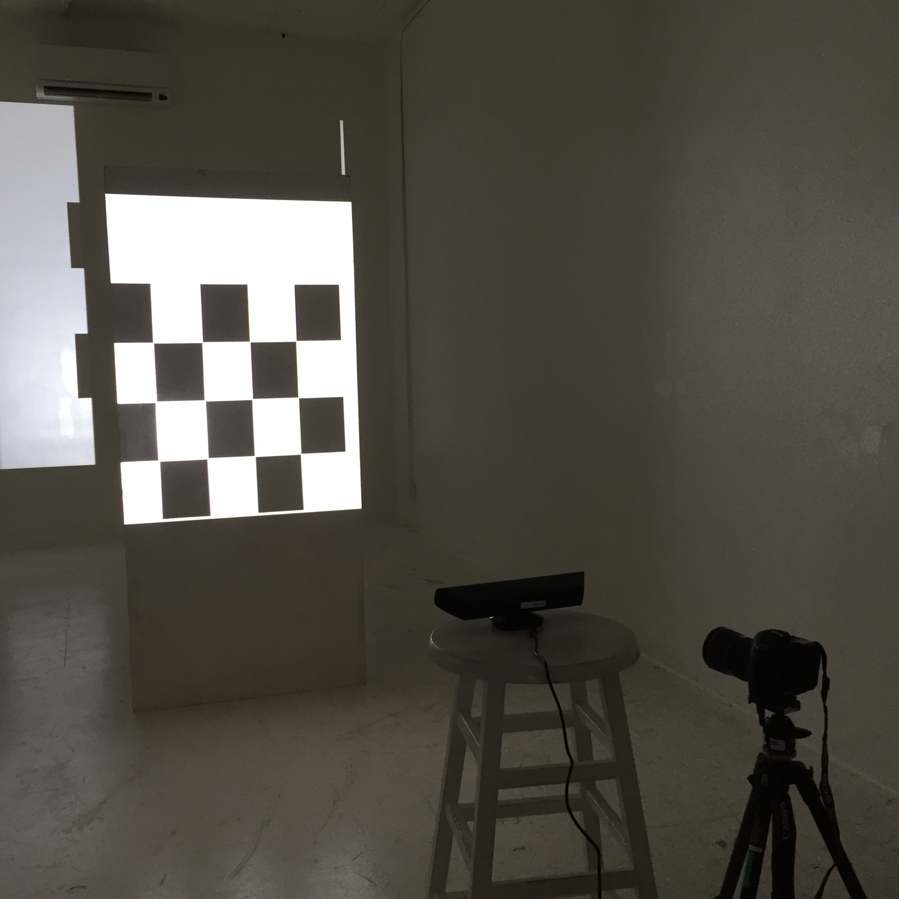
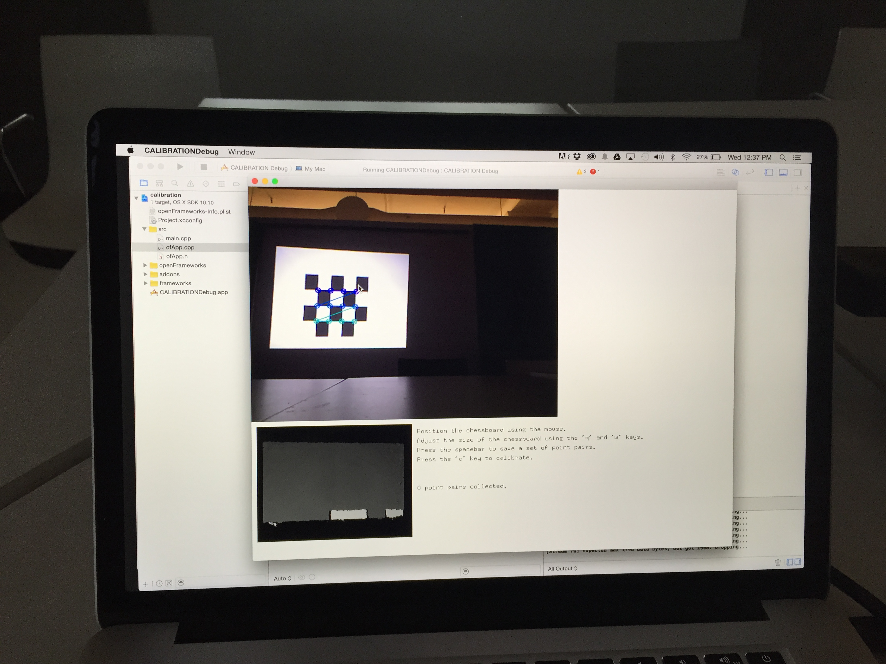

##CC Lab Final Open Frameworks Project
_____________________________________________

###Projection Mapping with Kinect

This project is made for use in a performance piece. A dancer moves in the line of sight of the Kinect and a colored outline of the dancers body is projected on the wall. Balls fall from the ceiling and the dancer is able to interact with the balls. 

Note: It will not run unless you have a kinect and a projector set up. 

_____________________________________________
**Add-Ons Dependencies**

ofxKinectProjectorToolkit

ofxPostProcessing

ofxOpenCV

ofxXmlSettings

ofxBox2D

ofxCV

ofxSecondWindow

ofxUI

_____________________________________________

Calibrating the space using the calibration project file from the ofxKinectProjectorToolkit library.

_____________________________________________

Images of the effects.

